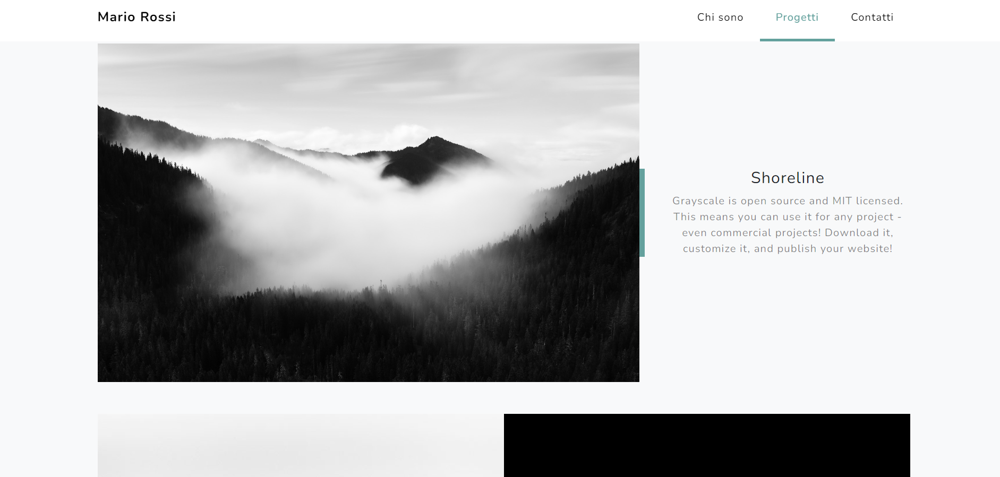

# Portfolio fotografia

Questo progetto tratta un sito web che simula un portfolio fotografico.

## Descrizione

Questo sito web vetrina è stato realizzato tramite un template di bootstrap per simulare un sito portfolio fotografico.

## Funzionalità

Il sito include le seguenti funzionalità:

- Iscrizione alla news letter
- hamburger menù per gli smartphone
- sito responsive per smartphone e tablet

## Tecnologie utilizzate

Il sito è stato sviluppato utilizzando le seguenti tecnologie:

- Bootstrap
- CSS

## Licenza

<!-- Questo progetto è stato rilasciato sotto la licenza MIT. Per ulteriori informazioni, leggere il file `LICENSE.md`. -->

## Crediti

Questo progetto è stato sviluppato da Katia Falletti.(https://it.linkedin.com/in/katia-falletti-616890225?trk=people-guest_people_search-card)
